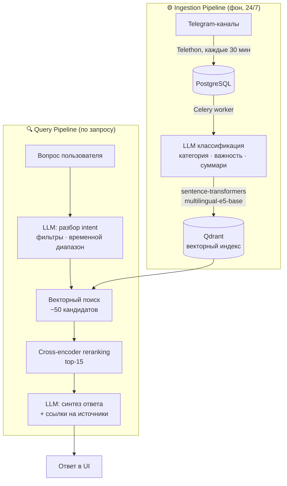

# VectorNews

> Персональный AI-аналитик финансовых новостей для трейдеров


Трейдер в среднем отслеживает 30–50 Telegram-каналов и тратит часы на ручной мониторинг. VectorNews берёт эту работу на себя: собирает новости круглосуточно, отсеивает шум, оценивает рыночную значимость событий и отвечает на вопросы на естественном языке — только по реальным данным из базы, без галлюцинаций.

---

## Как это устроено

Система состоит из двух независимых контуров. **Ingestion pipeline** работает постоянно в фоне и не зависит от активности пользователей. **Query pipeline** запускается по запросу и формирует ответ за секунды.



### Ключевые архитектурные решения

**Qdrant вместо pgvector** — нативная поддержка фильтрации по payload (категория, дата, важность) без деградации скорости поиска. pgvector при фильтрации по нескольким полям заметно проигрывает в производительности.

**Двухэтапный поиск с reranking** — первичный ANN-поиск возвращает ~50 кандидатов быстро, cross-encoder пересчитывает релевантность точнее и оставляет top-15. Это лучше работает, чем сразу искать точный top-k.

**HDBSCAN для горячих тем** — алгоритм не требует задавать количество кластеров заранее и хорошо обрабатывает новостной поток переменной плотности. После кластеризации LLM генерирует человекочитаемый заголовок для каждой темы.

**Celery для обработки новостей** — классификация и векторизация вынесены в отдельные воркеры. Ingestion pipeline не зависит от времени ответа LLM, задачи выполняются конкурентно.

---

## Стек

| Слой | Технология | Зачем |
|------|-----------|-------|
| API | FastAPI + async SQLAlchemy | Асинхронная обработка запросов, автодокументация |
| База данных | PostgreSQL 15 | Структурированное хранение новостей и пользователей |
| Векторный поиск | Qdrant 1.9 | Семантический поиск с фильтрацией по метаданным |
| Кэш / брокер | Redis 7 | Кэш ответов агента + очередь задач Celery |
| Фоновые задачи | Celery + Beat | Периодический парсинг и асинхронная обработка |
| Embeddings | sentence-transformers (`multilingual-e5-base`) | 768-мерные векторы, поддержка RU + EN |
| LLM | OpenRouter API | Классификация, синтез ответов, query expansion |
| Парсинг Telegram | Telethon | MTProto клиент для получения сообщений |
| Frontend | Vue 3 + TypeScript + Vite | SPA с Pinia, Vue Router, Tailwind CSS |
| Деплой | Docker Compose | 7 сервисов: postgres, redis, qdrant, api, worker, beat, nginx |

---

## Что умеет

**AI-ассистент** — вопросы на естественном языке, ответы с источниками. Агент разбирает intent запроса, выбирает релевантный временной диапазон и категории, строит ответ исключительно по данным из базы.

**Горячие темы** — каждый час система кластеризует новостной поток и формирует список главных событий дня с подборкой материалов по каждому.

**Ежедневный брифинг** — сводка ключевых событий, готовая с утра.

**Тематические ленты** — новости по категориям: геополитика, экономика, сырьё, крипта, корпоративное, макро.

**Персонализация** — каждый пользователь настраивает стиль ответов, приоритетные категории, глубину анализа и временной горизонт.

---

## Быстрый старт

Для локального запуска нужны Docker и учётные данные Telegram API + OpenRouter.

```bash
# 1. Клонировать и настроить окружение
git clone <repo>
cd ai_news
cp .env.example .env
# Заполнить .env: DATABASE_URL, REDIS_URL, QDRANT_URL,
#   TELEGRAM_API_ID, TELEGRAM_API_HASH, OPENROUTER_API_KEY, JWT_SECRET_KEY

# 2. Поднять инфраструктуру (PostgreSQL, Redis, Qdrant)
docker compose up -d

# 3. Применить миграции и запустить API
pip install -r requirements.txt
uvicorn app.main:app --reload

# 4. Celery worker + beat scheduler (в отдельных терминалах)
celery -A app.tasks.celery_app worker --loglevel=info
celery -A app.tasks.celery_app beat --loglevel=info
```

Или всё сразу в продакшн-режиме:

```bash
docker compose --profile prod up -d --build
```

Swagger UI: `http://localhost:8000/api/docs`
Frontend: `http://localhost:3000`

---

## Структура проекта

```
ai_news/
├── app/
│   ├── ai/                    # Обёртки над LLM и embeddings
│   ├── api/
│   │   └── endpoints/         # agent, dashboards, auth, admin
│   ├── models/                # SQLAlchemy: NewsPost, User, AgentSettings
│   ├── schemas/               # Pydantic-схемы запросов и ответов
│   ├── services/              # Бизнес-логика
│   │   ├── agent_service.py   # Оркестрация RAG-пайплайна
│   │   ├── vector_db_service.py
│   │   ├── reranker_service.py
│   │   ├── llm_service.py
│   │   └── telegram_service.py
│   ├── tasks/                 # Celery: парсинг, классификация, кластеризация
│   ├── config.py
│   └── main.py
├── frontend_mvp/
│   └── src/
│       ├── components/        # chat/, dashboard/, layout/, common/
│       ├── pages/             # Chat, Dashboard, NewsFeed, Settings, Admin
│       ├── stores/            # Pinia: auth, settings, theme
│       └── api/               # Axios-модули по доменам
├── docs/                      # Архитектурные заметки
├── docker-compose.yml
└── requirements.txt
```

---

## API

```
POST  /api/agent/chat                    Вопрос к AI-ассистенту
GET   /api/dashboards/hot-topics         Горячие темы (кластеры)
GET   /api/dashboards/daily-briefing     Сводка за день
GET   /api/dashboards/thematic           Новости по категории
GET   /api/news/recent                   Лента с пагинацией
GET   /api/agent/settings                Настройки персонализации
PUT   /api/agent/settings
POST  /api/auth/login
GET   /health
```

Полная документация — Swagger UI по `/api/docs`.